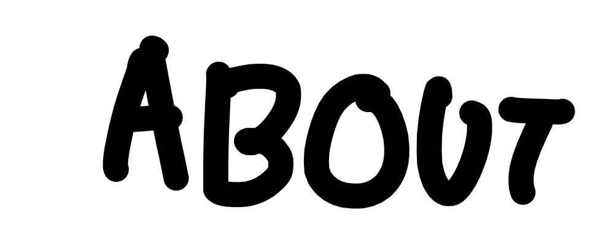

    

:]

    <a href="https://github.com/Me-Theo" width="20%" style="display:flex;align-items:center">
        
        <label style="margin-left:10px;font-weight: bold;">Alt git</label>
    </a>
    <a href="https://github.com/Me-Theo" width="20%" style="display:flex;align-items:center">
        
        <label style="margin-left:10px;font-weight: bold;">Personal Itch.io</label>
    </a>

