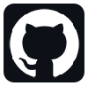
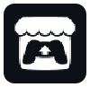

    

:]

    <a href="https://github.com/Me-Theo" width="20%" style="display:flex;align-items:center">
        
        <label style="margin-left:10px;font-weight: bold;">Alt git</label>
    </a>
    <a href="https://github.com/Me-Theo" width="20%" style="display:flex;align-items:center">
        
        <label style="margin-left:10px;font-weight: bold;">Personal Itch.io</label>
    </a>

<!--
**TheoBensaci/TheoBensaci** is a ✨ _special_ ✨ repository because its `README.md` (this file) appears on your GitHub profile.

Here are some ideas to get you started:

- 🔭 I’m currently working on ...
- 🌱 I’m currently learning ...
- 👯 I’m looking to collaborate on ...
- 🤔 I’m looking for help with ...
- 💬 Ask me about ...
- 📫 How to reach me: ...
- 😄 Pronouns: ...
- ⚡ Fun fact: ...
-->
